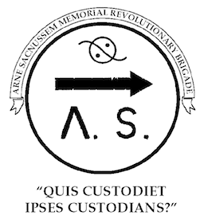

# README.md

## Fate Accelerated Edition ASMRB Version

The contents of this project contain files related to the **FAE-ASMRB** version of **Fate Accelerated Edition (FAE)** role-playing game rules, forked from the original FAE-SRD repository.

This project is intended to capture and share the house rules for the ASMRB.org Roleplaying Group's changes to the original FAE System Reference Document (SRD).

**FAE-ASRMB** is derived **"Fate Accelerated Edition SRD (System Reference Document) Creative Commons Version"** as published by Evil Hat Productions, LLC. at [www.faterpg.com](http://www.faterpg.com/wp-content/uploads/2013/06/Fate-Accelerated-SRD-CC.html) as of 2013-06-11, as referenced by the **"Fate Accelerated Edition SRD (System Reference Document — Creative Commons Version) Converted to Markdown (GitHub-Style) Format"** git project at [github.com/ChristopherA/FAE-SRD](http://github.com/ChristopherA/FAE-SRD) hosted by [Christopher Allen - RPG.net](mailto:ChristopherA@RPG.net).

Christopher Allen has no affiliation with Evil Hat Productions, LLC.

## Copyright & Credits

This work is based on _Fate Core System_ and _Fate Accelerated Edition_ (found at [http://www.faterpg.com](http://www.faterpg.com)), products of Evil Hat Productions, LLC, developed, authored, and edited by Leonard Balsera, Brian Engard, Jeremy Keller, Ryan Macklin, Mike Olson, Clark Valentine, Amanda Valentine, Fred Hicks, and Rob Donoghue, and licensed for our use under the [Creative Commons Attribution 3.0 Unported](http://creativecommons.org/licenses/by/3.0/) license .

Fate(tm) and Fate Dice(tm) are trademarks of Evil Hat Productions, LLC. The Powered by Fate logo is (c) Evil Hat Productions, LLC and is used with permission.

The Fate Dice(tm) images and Four Actions icons are derived from the Fate Core font, (c)Evil Hat Productions, LLC and is used with permission. The Four Actions icons were designed by Jeremy Keller.

The ASMRB logo is trademark of the dyvers hands of Arne Saknussemm Memorial Revolutionary Brigade and is used here with permission. It is  (c)2001 and licensed under restrictive [Creative Commons Attribution NonCommercial NoDerivatives ](http://creativecommons.org/licenses/by-nc-nd/4.0/). Please remove this logo from any derivative works.

**FAE-ASMRB** is (c)2014 Christopher Allen, All Rights Reserved. Reference to other copyrighted material in no way constitutes a challenge to the respective copyright holders of that material. FAE-ASMB is released in its entirety under the same [Creative Commons Attribution 3.0 Unported](http://creativecommons.org/licenses/by/3.0/) and [OGL](http://www.faterpg.com/licensing/licensing-fate-ogl/) licenses as the original FAE-SRD.

## Change History

* 1.0.0 - Initial Fork
  * Forked from FAE-SRD 1.0.2
  * Created branch to hold original FAE-SRD, renamed master .md, deleted converted files
  * Added ASMRB logo.
  * Updated README.md and Fate-Accelerated-ASMRB-CC.md as a new work derivative of FAE-SRD.
